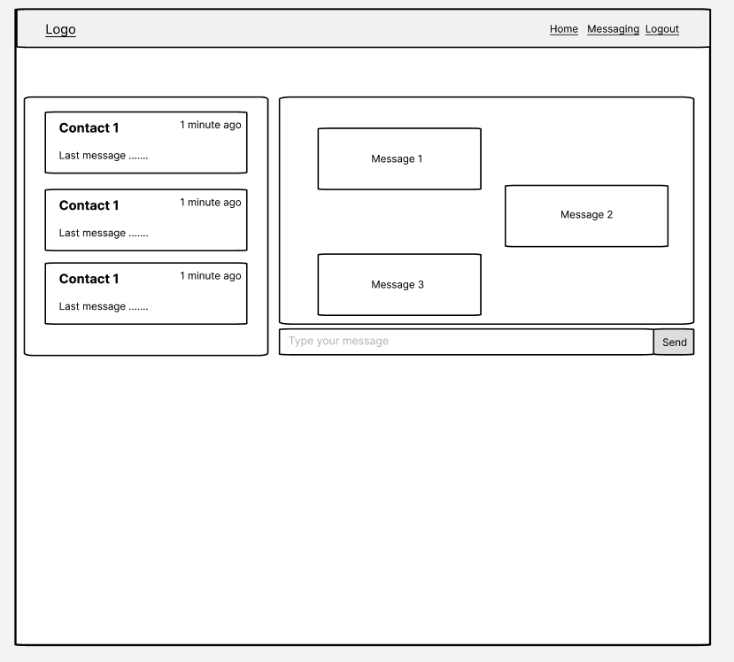
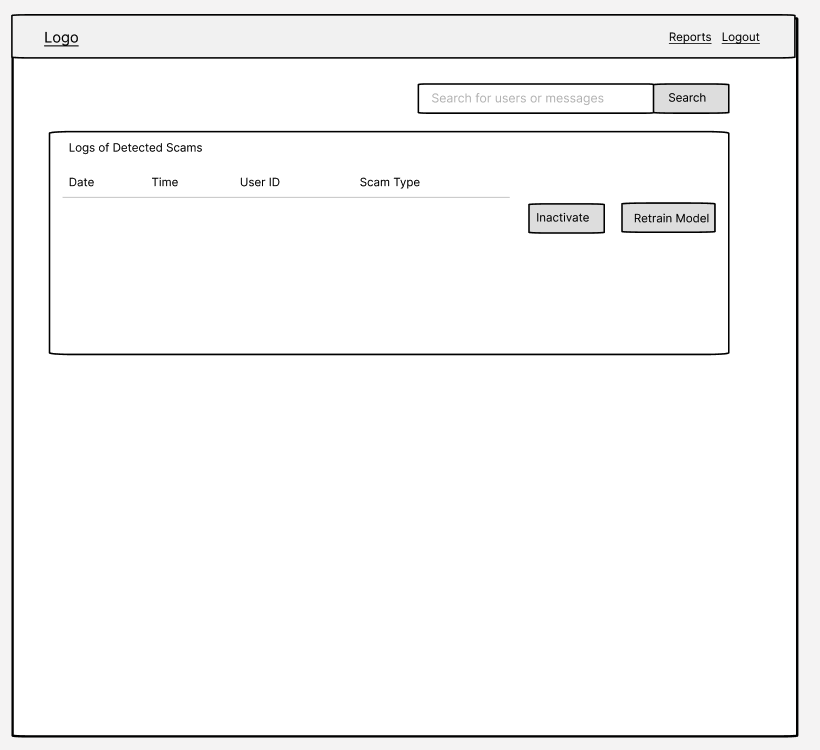

# Project Title

ScamShield Integration

## Overview

ScamShield is an advanced machine learning tool designed to be integrated into existing messaging platforms. It detects potential scam messages and alerts users, helping them avoid scams and protecting their personal information.

### Problem

Messaging platforms are often exploited by scammers who deceive users with fraudulent messages. There is a need for an automated system to identify these scams and warn users in real-time, enhancing user safety and trust.

### User Profile

 **Platform Users**:

- Send and receive messages safely.

- Receive alerts if a scam is detected in their messages.

**Platform Admins**:

- Monitor and manage scam detection logs.

- Take necessary actions based on scam reports.

### Features

**Real-Time Scam Detection**:

- As a user, I want my incoming messages to be analyzed for potential scams.

- As a user, I want to receive an automated warning if a scam is detected.

**Admin Dashboard**:

- As an admin, I want to view and manage detected scam reports.

- As an admin, I want to store and review information about detected scammers.

## Implementation


### Tech Stack

**Frontend**:

- React.js

- Axios

**Backend**:

- Node.js

- Express.js

- MySQL

**Machine Learning**:

- Pre-trained Large Language Model (LLM) API for scam detection

### APIs

 **LLM API**:

- For analyzing messages and detecting scams.

**Internal APIs**:

- Message submission

- Scam alert system

- Admin data retrieval

### Sitemap

- Home page

- Messaging interface

- Admin dashboard

### Mockups
## Home Page


## Messaging Interface


## Admin Dashboard


### Data

**Messages**:

- Sender

- Receiver

- Content

- Timestamp

**Scam Reports**:

- User information

- Message content

- Detection result

- Timestamp

### Endpoints

**POST /messages/send**

- Send a message

Parameters:
- sender: User ID

- receiver: User ID

- content: Message content

Response:
```
{
	"message": "Message sent successfully",
	"data": {
		"sender": "user1",
		"receiver": "user2",
		"content": "Hello!",
		"timestamp": "2024-08-06T12:00:00Z"
		}
}
```

**POST /messages/analyze**
- Analyze a message for scams

Parameters:
- messageId: ID of the message to analyze

Response:
```
{
	"result": "scam/legitimate",

	"message": "Analysis complete"
}
```
 
**GET /admin/scams**

- Retrieve detected scam reports

Response:

```
[
	{
	"id": 1,
	"user": "user@example.com",
	"message": "Suspicious message content",
	"timestamp": "2024-08-06T12:00:00Z"
	},
	...
]
```

**POST /users/register**

- Register a new user

Parameters:
- email: User's email
- password: User's password

Response:
```
{ 
	"token": "jwt-token"
}
```

**POST /users/login**
- Login a user

Parameters:
- email: User's email
- password: User's password

Response:
```
{
	"token": "jwt-token"
}
```

### Auth

- JWT authentication

- Store JWT in localStorage

- Include JWT in axios calls

- Differentiate UI for logged-in users and admins

  

## Roadmap

**Week 1**:

- Set up React frontend and Node.js backend

- Implement basic messaging functionality

- Integrate LLM API for scam detection

**Week 2**:

- Develop automated user alerts

- Create admin dashboard for scam report management

- Finalize UI/UX design

- Conduct testing and debugging
  
## Nice-to-haves

- Implement real-time message updates with WebSocket

- Enhance scam detection accuracy with custom training data

- Develop mobile-friendly UI

- Include reporting and analytics for admins